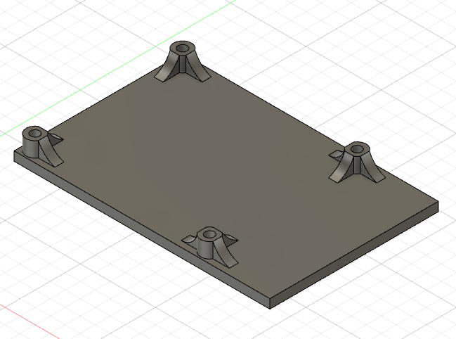

# AWS Greengrass Edge Development Kit - 3D Printing

This section contains all the .STL files and descriptions needed to 3d print the AWS Greengrass development kit enclosures and internal standoffs. 

**Note:** The top enclosure is still being optimised to fix up some alignment issues (image far below) of the internal USB and power ports to the casing. We don't recommended committing to printing v1 or at least not the top enclosure just yet. We will provide a updated design soon.

#### AWS Greengrass Development Kit V1 - base-plate.stl
* Aprox 3.5 Hrs print

#### AWS Greengrass Development Kit V1 - pi-standoff-plate.stl
* Aprox 2 Hrs Print

#### AWS Greengrass Development Kit V1 - neural-stick-standoff.stl
* Aprox 2 Hrs print

#### AWS Greengrass Development Kit V1 - top-enclosure-cover.stl
* Aprox 12.5Hrs print

#### AWS Greengrass Development Kit V1 - Top Cover Alignment Issues

As of V1 of the AWS Greengrass development kit we are still dealing with some alignment and internal wiring design changes to the 3D printed components. Because of this we don't recommend printing at least the top enclosure at the moment. We will have an update to this problem soon. alignment

