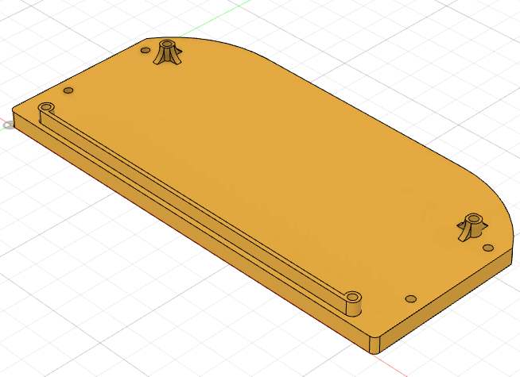
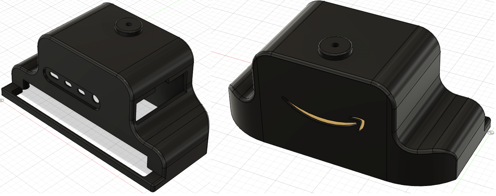

# AWS Greengrass Edge Development Kit - 3D Printing

This section contains all the .STL files and descriptions needed to 3d print the AWS Greengrass development kit enclosures and internal standoffs. 

#### AWS Greengrass Development Kit V1 - base-plate.stl
* Aprox 3.5 Hrs print

#### AWS Greengrass Development Kit V1 - pi-standoff-plate.stl
* Aprox 2 Hrs Print

#### AWS Greengrass Development Kit V1 - neural-stick-standoff.stl
* Aprox 2 Hrs print

#### AWS Greengrass Development Kit V1 - top-enclosure-cover.stl
* Aprox 12.5Hrs print

