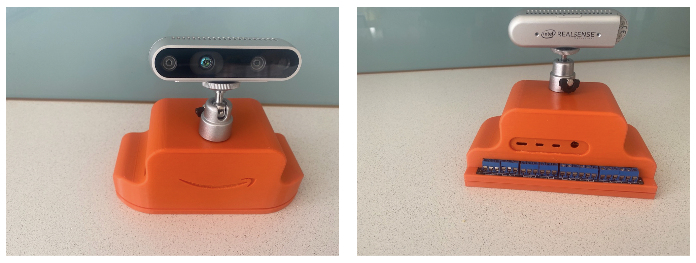
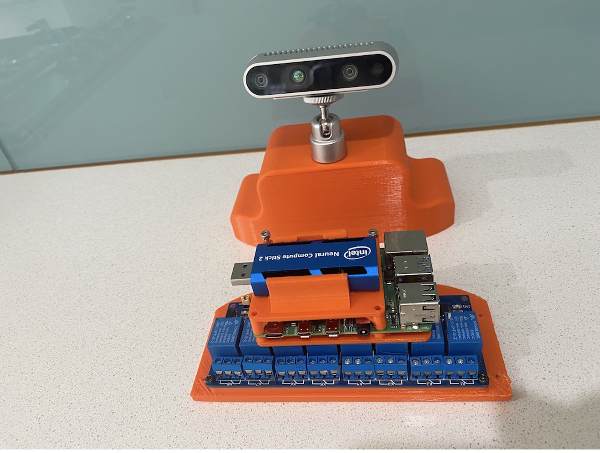
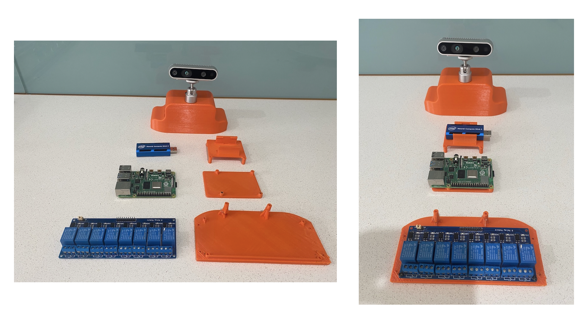
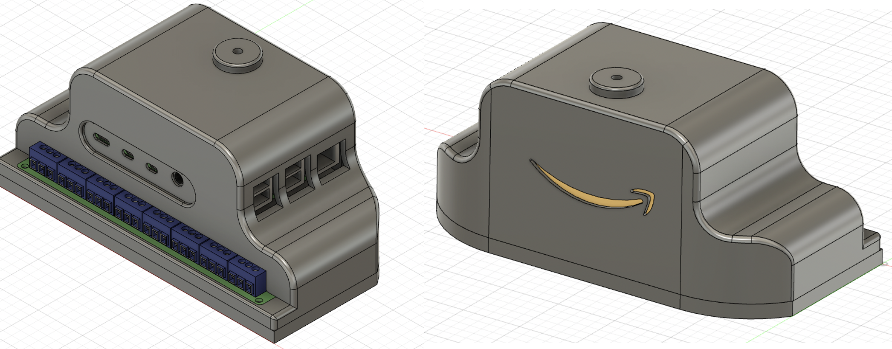
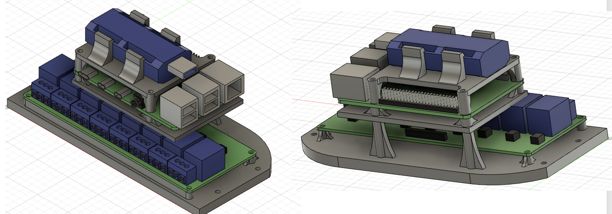

# AWS Greengrass Edge Development Kit

Universal AWS IoT Greengrass edge development kit with ML Object Detection and Depth Perception. Based on a Raspberry Pi4, provides edge inference of RBG and depth images as well as an array of sensors and actuators. Interfaces include a GPIO controlled 8-port 250v/10A Relay board, I2C temperature, moisture, etc sensors and 8 x native GPIO pins all controlled and managed from the AWS IoT and data platform. 

The pièce de résistance however is an Intel RealSense d453i depth perception camera and the Intel Neural Compute Stick 2 providing 3D and depth image ML inference on the edge with hardware accelerated neural processing. These are optional components depending on your budget (the project supports a simple webcam as well) but they go a long way to showing the kind of advanced peripheries and use-cases you can serve on the edge with AWS Greengrass. 

**V1 is a Work in Progress:** This is version 1 and very much in MVP territory. Not all code samples are complete and there isn't a complete deployment guide, etc.. We will continue to iterate on the concept and happy to take comments and requests through the repo's Issues section. 

### AWS Greengrass Development Kit V1

#### AWS Greengrass Development Kit V1 - Lid Off

#### AWS Greengrass Development Kit V1 - Expanded

### Who is this Project For?
This project is to enable and encourage those with an interest in developing and learning advanced edge compute and computer vision use-cases using AWS IoT and AWS Greengrass.

* **Students:** Would make an awesome university / college engineering project.
* **Teachers / Lectures:** A great learning aid for classroom prac's and workshops,
* **Developers:** Step by step guide to building deployment pipelines and code examples for AWS Greengrass.
    * (TBA application integrating to IoT management)
* **Enthusiasts:** Looking for the next interesting project in the rapidly growing world of edge compute and IoT.
* **Home Automation / Security:** Bringing an array of 240v/10A and logic I/O's and computer vision managed from AWS cloud. 
* **Data Scientists:** To develop and test ML computer vision models on edge devices.
* **IoT specialists:** Developing professional skills on AWS and advanced IoT Edge Compute.
* **IoT Technology Businesses:** Low cost PoC / quick start to value realisation.

### Code Examples
Code examples include standalone and AWS Lambda python code for:
* Capture synchronised RealSense RBG and Depth Image for inference and processing,
* Capture a USB Webcam image for inference (So depending in budget you don't need the RealSense Camera)
* Perform Image Inference on Mxnet Model on Ras Pi CPU (So depending on budget you don't need the Compute Stick)
* Perform Image Inference on Intel Neural Compute Stick 2
* Capture local temperature from a I2C interface,
* Actuate GPIO Relay Board
* Generic GPIO I/O.

### Reansense Depth-Colour Maps

One of the use-cases is to take a standard RGB image and use for inference against a Machine Learning Object Detection model then if one of the desired objects is detected, to take a distance measurement to it such as shown in the below depth colour maps:  

That's me at my desk writing this guide! The ML model detected a person and then measured a distance of just over 1 meter away.

### AWS Greengrass Development Kit V1 - CAD Designs

3D printed enclosure and internal standoffs (3D print STL files) included:

### Example Use Cases for Computer Vision / Depth on Edge Compute with I/O Actuators

* **Safety**: Forklift or manufacturing machinery detect person in ‘Red / Danger Zone’ and action alarm / alert or machine stop via local relay. Cloud notification for analytical / BI of near miss.
* **Retail:** Person waiting at counter time and notification, counter queue depth count, etc
* **Robotics:** Collision avoidance, Drive to Object.
* **Robot Arm:** Detect and capture object. (Depth camera is detachable, can be mounted on robot arm extension). 
* **General Development:** Enablement, training and education on AWS Greengrass edge device capability.

