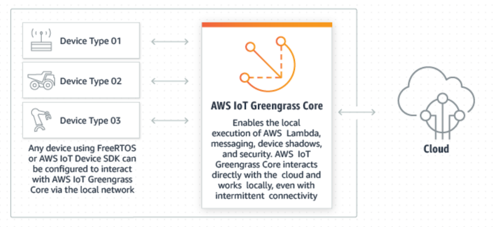
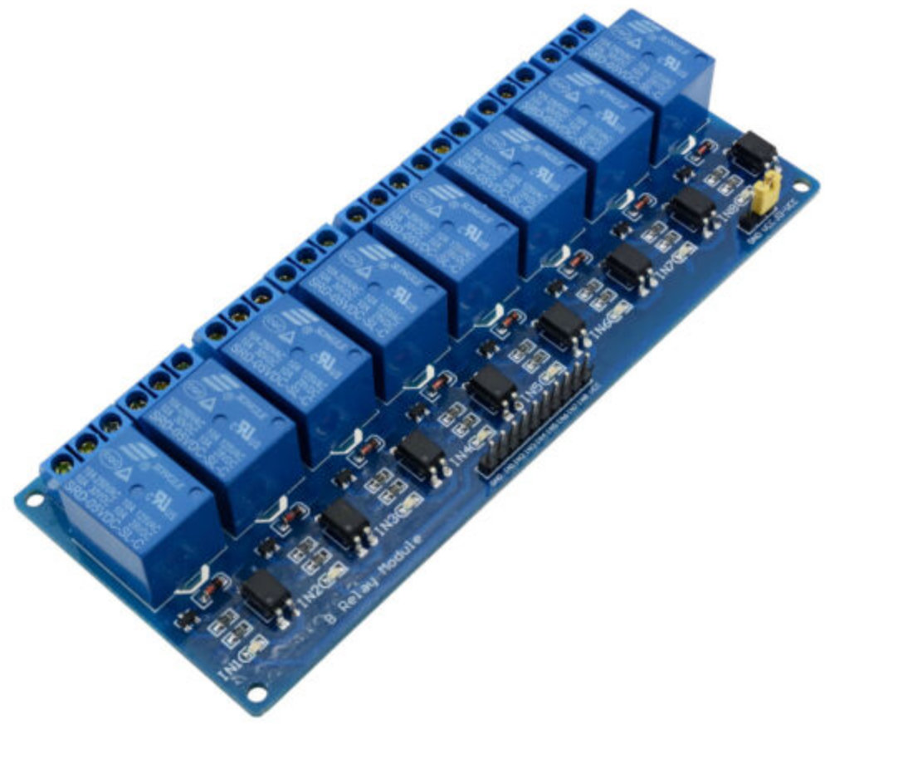

# AWS Greengrass Edge Development Kit

### Getting Started
This is the getting started build guide for the AWS Greengrass IoT Edge Development Kit. Here you will see all the steps needed to get to a minimal AWS Greengrass IoT Edge prototype running with just a Raspberry Pi and an AWS account. Depending on your interest you can then pick and choose any or all additional components from the I2C temperature sensor and GPIO controlled relay board, the servo and DC-Motor controllers right through to a edge computer vision and depth perception application using a standard web cam or the RealSense series of 3D depth cameras depending on your budget and application. Finally, if you want to wrap it all up in a neat and presentable package you can choose to 3D print the custom enclosure we provide with the project.

This section will focus on the build, configuration and physical components of the project. For a detailed deployment guide for each of the individual components go to the respective deployment sections. 

### Table of Contents:

1) [What is AWS IoT Greengrass](#What is AWS IoT Greengrass)
1) [AWS IoT Training and Support](#AWS IoT Training and Support)
1) [Create / Access an AWS Account](#Create / Access an AWS Account)
1) [Build Raspberry Pi 3/4](#Build Raspberry Pi)
1) [Installing AWS IoT Greengrass Core Software](#Installing AWS IoT Greengrass Core Software)
1) [Build Requirements: AWS IoT Greengrass Example Functions](#AWS IoT Greengrass Example Functions)
    a) [GPIO Control](#GPIO Control)
    b) [GPIO Controlled Relay Board](#GPIO Controlled Relay Board)
    c) [Web Cam USB Interface](#Web Cam USB Interface)
    d) [Intel RealSense d435i Depth Camera](#Intel RealSense d435i Depth Camera)
    e) [ Intel Neural Compute Stick 2](#Intel Neural Compute Stick 2)
1) [3D Printed Enclosure](#3D Printed Enclosure)

### What is AWS IoT Greengrass
Before we kick off it's a good time to provide a quick explanation of what exactly AWS IoT Greengrass is and what it does. 

**So, What is AWS IoT Greengrass:**
AWS IoT Greengrass lets you build IoT solutions that connect different types of devices with the cloud and each other. Devices that run Linux, including distributions such as Ubuntu and Raspbian, and support Arm or x86 architectures can host the AWS IoT Greengrass Core software. The AWS IoT Greengrass Core software enables the local execution of AWS Lambda code, messaging, data management, and security. Devices running AWS IoT Greengrass Core act as a hub that can communicate with other devices that are running FreeRTOS or have the AWS IoT Device SDK installed. These devices could vary in size, from smaller microcontroller-based devices to large appliances. 

**For more detail see:** 
[AWS IoT Greengrass](https://aws.amazon.com/greengrass/)  
[What is AWS IoT Greengrass](https://docs.aws.amazon.com/greengrass/latest/developerguide/what-is-gg.html)

**AWS Greengrass Core Edge Dev Kit Project:**
In this project we are going to use our Raspberry Pi as the AWS IoT Greengrass core which will allow us to securely manage and communicate with the Raspberry Pi and the connected peripheries from the AWS IoT console where ever it is in the world as long as it has an Internet connection. One of the great features of AWS IoT Greengrass is once the core device is configured it will continue to operate even if it loses its Internet connection and so provides highly reliable edge compute functionality.

We will use AWS IoT Greengrass to deploy AWS Lambdas which provide a container to run our code in to the Raspberry Pi. This code will control the edge compute use cases and trigger actions such as control the relay board or take an image and perform machine learning object detection. 

### AWS IoT Training and Support
If you're new to AWS or AWS IoT and want to deep dive on the functionality the below links offer a number of free training resources and introductory user guides

* [AWS IoT Home](https://aws.amazon.com/iot/)
* [AWS Internet of Things Foundation Series](https://www.aws.training/Details/Curriculum?id=27289)
* [AWS IoT Whitepapers and Technical Guides](https://aws.amazon.com/whitepapers/?whitepapers-main.sort-by=item.additionalFields.sortDate&whitepapers-main.sort-order=desc&whitepapers-main.q=iot&whitepapers-main.q_operator=AND#iot)
* [IoT Atlas](https://iotatlas.io/)

### Create / Access an AWS Account
The first step is to make sure you have access to an AWS account and have a valid IAM user.  

* **Access or create an AWS Account:** If you don't already have access to an AWS account and IAM User, you can create by following this guide: [Create an AWS Account](https://aws.amazon.com/premiumsupport/knowledge-center/create-and-activate-aws-account/)  

### Build Raspberry Pi3/4  

For this purpose it is assumed you have a Raspberry Pi 3/4 that is loaded with the latest 32-bit Raspberry Pi OS (previously called Raspbian). This can be found here: [Raspberry Pi OS](https://www.raspberrypi.org/downloads/raspberry-pi-os/).

**Note:** If intending to add the RealSense camera, Intel Compute Stick or perform any image inference on the Raspberry Pi CPU directly we highly recommend a Pi4 with at least 4G memory over a Pi3.

### Installing AWS IoT Greengrass Core Software

* Configuring a Raspberry Pi for AWS Greengrass:
For a detailed guide on configuring a Raspberry Pi as an AWS IoT Greengrass core work through this guide: [Setting Up a Raspberry Pi As an AWS Greengrass Core](https://docs.aws.amazon.com/greengrass/latest/developerguide/setup-filter.rpi.html)

Stop before you get to the section on installing the AWS Greengrass Core software and follow the below.

* Installing AWS Greengrass Core Software
When it comes to installing the AWS Greengrass core Software we recommend using this [Quick Start Greengrass Device Setup](https://docs.aws.amazon.com/greengrass/latest/developerguide/quick-start.html).

Say yes to publishing the 'Hello World' example so you can more easily test the service and learn the AWS IoT Greengrass console. 

Once complete verify you are receiving 'HelloWorld' MQTT messages from your Raspberry pi in the AWS IoT Console by following this guide: [Verify the Lambda function is running on the core device](https://docs.aws.amazon.com/greengrass/latest/developerguide/lambda-check.html)

[AWS IoT Greengrass Hello World](pics/greengrass-intro.png)

At this stage its assumed you have a configured Raspberry Pi with AWS IoT Greengrass with the Hello World service deployed and have been able to log into the AWS IoT console and see the MQTT messages arriving on the *'hello/world'* topic.

### AWS IoT Greengrass Example Functions:
### GPIO Control

The first of the provided AWS IoT Greengrass functions you can deploy is the GPIO Control example given in: TBA GPIO Deployment
This example lets you set GPIO pins on the Raspberry Pi as either Inputs or Outputs. If an input pin changes state it is reported to the AWS IoT core platform using MQTT messaging and similarly, you can set the state of the output pins form the AWS IoT Core console by sending suitable MQTT messages to the Raspberry Pi.

There is no additional hardware required to deploy this project so is nothing more to do in the build section. To deploy, follow the deployment guide at: **TBA.**

### GPIO Controlled Relay Board

The GPIO controlled relay board builds on the previous example to include a 250v/10a relay board that allows you to switch on and off high powered devices from the AWS IoT console. By adding this functionality, you can build home automation, security and automated garden or water tank pumping system or automation for any high-powered devices. 

*Note:** Do not use this on mains powered devices unless you are qualified to do so in your region. 

An example of relay board used is available for less than $10 here: [GPIO Relay Board](https://www.ebay.com.au/itm/1PCS-8-Channels-Relay-Board-Module-for-Arduino-Raspberry-Pi-ARM-AVR-DSP-PIC/182491477413?hash=item2a7d56f5a5:g:H20AAOSwQaJXRwdv)

This model of relay board is very common and so you should be able to find one of similar design in your region. Any GPIO controlled relay board is acceptable however, the 3D printed enclosure is designed around this model so if you intend to build the enclosure as well then look for this or an equivalent model. 

Once you have the GPIO Relay board then go to the GPIO Relay board deployment guide at: **TBA**

### I2C Temperature Sensor

The I2C temperature sensor is based on any I2C LM75A Temperature Sensor development board. 
You can find an example here: [LM75A Temperature Sensor I2C](https://www.ebay.com.au/itm/LM75A-Temperature-Sensor-I2C-High-Speed-Interface-Development-Board-2-8V-5-5V/362754212574?hash=item5475d602de:g:7RQAAOSwBWde~~yI&frcectupt=true)

[I2C LM75A Temp Sensor](pics/greengrass-i2c-temp.png)

**Note:** Just be aware that some of these LM75A development boards (usually the less expensive ones) don't come with the headers pins soldered in place. If you don't have a soldering iron or don't want to deal with soldering header pins just check this before you purchase. 

Once you have the LM75A temperature development board then go to the I2C Temperature sensor guide at: **TBA**

### Web Cam USB Interface
**TBA**

### Intel RealSense d435i Depth Camera

### Intel Neural Compute Stick 2

### 3D Printed Enclosure

See the section [3D Printed Components](../3d-printing-stl)
