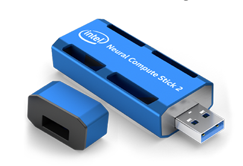
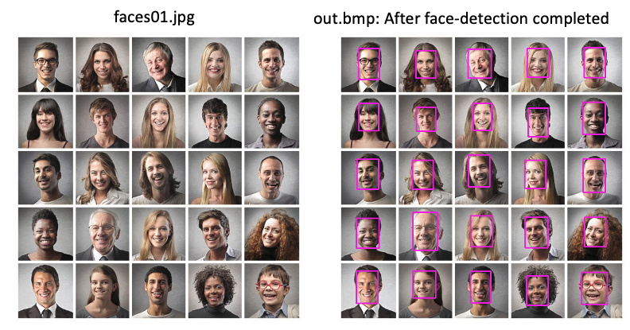

# AWS Greengrass Edge Development Kit

### Intel Neural Compute Stick 2

The Intel Neural Compute Stick (NCS) 2 provides 16 programmable shave cores and a dedicated neural compute engine for hardware acceleration of deep neural network inferences. The neural compute stick packs a lot of power for its size, power consumption and cost making it well suited to edge compute computer vision projects. It off-loads the heavy lifting of object detection from the Raspberry Pi CPU improving frame rate significantly while leaving the CPU free for managing other processes such as the AWS Greengrass message processing and I/O control. 



### Code Examples

in this section there is a Intel generated standalone Python script that can be used to test a single inference and a AWS Greengrass Lambda for managing the same form eth AWS IoT Core service. 

**Standalone Code:**
To test the compute stick locally we forst need to download a suitable model. in this caase we will download a face detection  model from the Intel model library:

Below assumes you are in the root directory of this repo that is cloned to your Raspberry Pi with Intel OpenVino installed and configured. 

```
# cd into the compute stick models directory:
cd src/compute-stick/intel-models/

# Download an Intel face detection model:
wget --no-check-certificate https://download.01.org/opencv/2020/openvinotoolkit/2020.1/open_model_zoo/models_bin/1/face-detection-adas-0001/FP16/face-detection-adas-0001.bin

wget --no-check-certificate https://download.01.org/opencv/2020/openvinotoolkit/2020.1/open_model_zoo/models_bin/1/face-detection-adas-0001/FP16/face-detection-adas-0001.xml


# cd back to the compute stick standalone directory
cd ../standalone

# Now complete an inference on the provided image: faces01.jpg

python3 object_detect_ssd.py -m ../intel-models/face-detection-adas-0001.xml -d MYRIAD -i ../pics/faces01.jpeg 
```

This will load the model to the Compute Stick, peform the inference and box bound any identifoed faces and out put to a new file **out.bmp**

