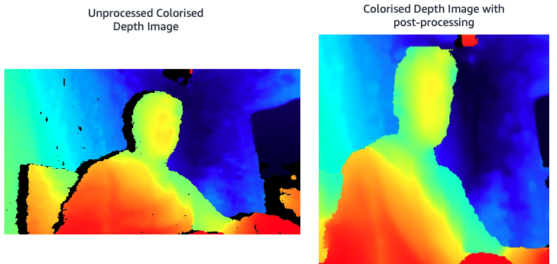

# AWS Greengrass Edge Development Kit

#### Intel RealSense d435/d415 Camera Code Examples

In this directory you will find standalone and AWS Greengrass / Lambda examples for how to connect to the Intel RealSense d345 camera on the Raspberry Pi (or other AWS Greengrass device) and capture an RBG and Depth image then take a depth measurement to the center of the frame. The depth data is logged to SysOut and in the case of the AWS Greengrass example, is posted over MQTT back to the AWS IoT core for analysis or other action.

Code examples in this directory:
1) **realsense-simple.py:** Standalone and Lambda example for interacting with the RealSense Camera using default settings and no image post-processing.
1) **realsense-advanced.py:** Standalone and Lambda example for interacting with the RealSense Camera using a selection of pre-set configurations for different requirements with image post-processing and resizing. 

#### Intel RealSense Colorised Depth Image
All going well you will save an unprocessed (realsense-simple.py) and a processed and unprocessed (realsense-advanced.py) colorised depth image as shown below.

#### Intel RealSense d435/d415 Camera Settings  

The Intel RealSense series of depth perception cameras are complicated little beasts with the a lot of customisations available. By far the simplest way to get started developing is to install the intel realsense-viewer application from: [Realsense-Viewer](https://github.com/IntelRealSense/librealsense)  

**Note:** See the Raspberry PI install section for detailed instructions for installing the RealSense viewer and SDK on the Raspberry Pi.

The RealSense Viewer connects to the RealSense camera over USB and allows you to display the output of the RBG, IR and colourised depth images. It also provides an interface to all of the many customisable settings on the D4xx series Intel RealSense cameras. 

We have however added a series of [Pre-set Config](./preset-configs/) files based on those provided by Intel at: [Intel Git Configs](https://github.com/IntelRealSense/librealsense/wiki/D400-Series-Visual-Presets). You can swap between the pre-set configs by updating the PRESET_CONFIG variable in the realsense-advanced.py code example.
