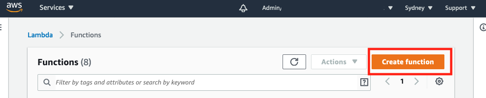
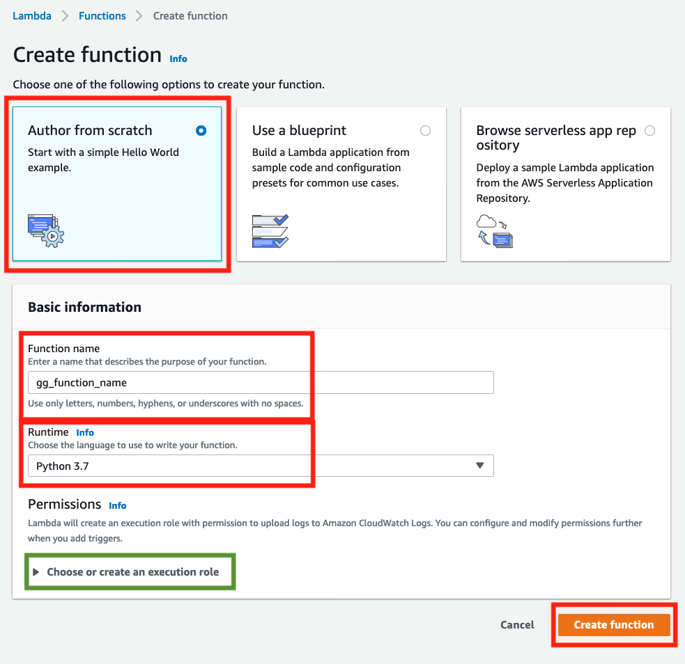
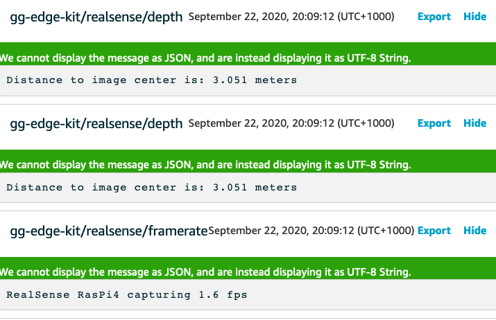

# AWS Greengrass Edge Development Kit

### Intel RealSense AWS lambda / Greengrass Code Examples

Code examples in this directory can be deployed as AWS Greengrass Lambda's to access the RealSense camera on edge devices managed by AWS Greengrass and IoT Core.

The lambda function **lambda_function.py** can call either of the modules:
* **realsense-simple.py** which initialises the RealSense camera with simple defaults and doesn't offer any image post-processing 
* **realsense-advanced.py** which initialises the RealSense camera with pre-configured RS400 advanced device settings and offers post-processing to the captured depth frames.

Both classes offer the below functions:
* **get_rbg_depth_frames():** Returns the next available RealSense captured colour and depth frame
* **get_frames_as_np_array():** Returns the next available RealSense captured colour and depth frame as a NP Array 
* **get_distance_to_frame_pixel(x, y)**: Returns (in meters) the distance in the next available RealSense captured depth frame measured at the x, y pixel (centres the measured pixel if x, y not provided)
    * In the realsense-simple class this is performed on the unprocessed depth frame
    * In the realsense-advanced class this is performed on a post-processed depth frame
* **def close_realsense_connection():** Gracefully closes the connection to the RealSense Camera.

### Package and Deploy the Lambda
Pre-packaged  **realsense-simple-lambda.zip** and **realsense-advanced-lambda.zip** files are provided and ready to deploy to AWS. 

### To Deploy the ZIPs to Lambda:
* In the AWS Console go to the **Lambda service** and select **Create Function**:


* In the **Create function** page:
    * Select **Author from scratch**, 
    * Enter the **Function Name**, in this case use **gg_realsense_simple_depth** or **gg_realsense_advanced_depth**
    * For **Runtime** select **Python 3.7**
    * If not done for a previous Lambda, you may need to **Create an execution role**
    * Click **Create function:**


* Once created, in the Lambda **Function Code** click **Actions** and select **Upload a .zip file**
    * Select the zipped lambda function you wish to deploy.


**Note:** For more detail on how to package and deploy an AWS GreenGrass Lambda see: 
[Create and package a Lambda function](https://docs.aws.amazon.com/greengrass/latest/developerguide/create-lambda.html)

### Depth Being Messaged to AWS IoT Core using MQTT
We will develop a more complete deployment guide in a future release however, if you successfully deployed the Lambda to your Raspberry Pi as an AWS Greengrass service then you should see the following message stream being returned to the AWS IoT Core over MQTT on the topic: **gg-edge-kit-realsense/depth**:


The above is showing the distance measured in the center of the frame for the RealSense device. You will be able to manipulate the value by holding your hand closer and further away from the RealSense camera.  

### Simple and Advanced RealSense modes:
To swap between the simple and advanced RealSense options, just update the below code in **lambda_function.py** to suit:
```
# Select the simple or advance config and feature set by swapping the rs_device comment below:
rs_device = RealsenseSimple()
# rs_device = RealsenseAdvanced()
```

### Updating and Packaging the Lambda Code Examples:
If you want to update or change the code and make a new AWS Greengrass Lambda deployment bundle just zip the lambda_functon.py, any dependencies and the greengrasssdk as such:
```
zip -r my-new-gg-lambda-bundle.zip greengrasssdk dependency-dir lambda_function.py
```

This will create a zip file: **my-new-gg-lambda-bundle.zip** that can be deployed to AWS Lambda following the above procedure.

### Testing the Lambdas
A test script **main.py** is provided for simple local tests. 
To execute:
```python3 main.py```

**Example:** The expected output is as below:
```
python3 main-test.py
2020-09-22 17:23:36,174 - realsense.realsense_simple - [INFO] - Initialising Realsense Camera
2020-09-22 17:23:37,010 - realsense.realsense_simple - [INFO] - Intel RealSense D435I - Serial:021222072868 Successfully Initialised
REALSENSE-SIMPLE: Distance in frame at x: 440, y:220 is: 0.899
REALSENSE-SIMPLE: Distance in frame at x: 440, y:220 is: 3.226
REALSENSE-SIMPLE: Distance in frame at x: 440, y:220 is: 3.211
REALSENSE-SIMPLE: Distance in frame at x: 440, y:220 is: 3.196
REALSENSE-SIMPLE: Distance in frame at x: 440, y:220 is: 3.196
REALSENSE-SIMPLE: Distance in frame at x: 440, y:220 is: 3.166
^CExiting.....
2020-09-22 17:23:39,569 - realsense.realsense_simple - [INFO] - Realsense pipeline successfully closed for Intel RealSense D435I - Serial 021222072868
```
